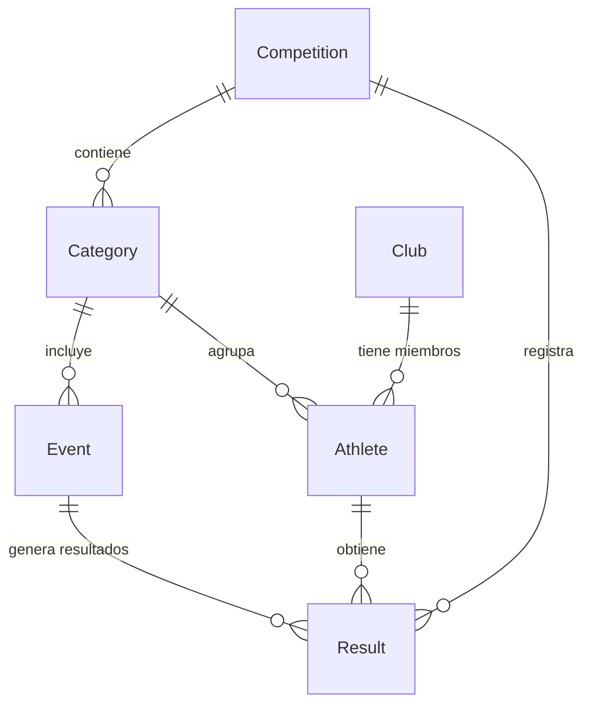

# Modelo de Entidades

Este documento describe el modelo de entidades de la aplicación de Gestión de Competiciones de Atletismo (Pista y Campo).

## Resumen de Entidades

La aplicación está compuesta por las siguientes entidades principales:

- **Competición**: Representa una competición de atletismo.
- **Categoría**: Define los grupos de atletas según género y rango de edad (por ejemplo: Masculino U18, Femenino U20).
- **Prueba**: Representa una disciplina específica de atletismo (por ejemplo: 100 metros planos, salto de longitud, lanzamiento de bala).
- **Club**: Representa el club deportivo al que pertenece un atleta.
- **Atleta**: Representa a un deportista que participa en las competiciones.
- **Resultado**: Registra el desempeño obtenido por un atleta en una prueba específica.

---

# Relaciones entre Entidades

---

# Descripción de las Entidades

## Competición

Representa un evento de atletismo que puede ser administrado por los usuarios con rol de administrador.

### Clave Primaria

`id` (generado mediante secuencia)

### Atributos Principales

- Nombre
- Fecha
- Ubicación
- Estado (por ejemplo: planificada, en curso, finalizada)

---

## Categoría

Define el grupo al que pertenece un atleta según su género y rango de edad. Las categorías determinan las pruebas en las que pueden competir los atletas.

### Clave Primaria

`id` (generado mediante secuencia)

### Atributos Principales

- Nombre (por ejemplo: **Masculino U18**, **Femenino U20**)
- Género (`MALE`, `FEMALE`)
- Año de nacimiento inicial
- Año de nacimiento final

### Relaciones

- Pertenece a una Competición.
- Tiene asignadas múltiples Pruebas.
- Contiene múltiples Atletas (asignados automáticamente según el año de nacimiento y el género).

---

## Prueba

Representa una disciplina específica dentro de una categoría (por ejemplo: 100 metros planos o salto de longitud).

### Clave Primaria

`id` (generado mediante secuencia)

### Atributos Principales

- Nombre (por ejemplo: **100 metros planos**, **Salto de longitud**)
- Tipo (`TRACK`, `FIELD`)
- Unidad de medida (segundos, metros, centímetros, etc.)

### Relaciones

- Pertenece a una Categoría.
- Tiene múltiples Resultados.

---

## Club

Representa un club deportivo al que pueden estar afiliados los atletas.

### Clave Primaria

`id` (generado mediante secuencia)

### Atributos Principales

- Nombre
- Abreviatura
- Ubicación

### Relaciones

- Tiene múltiples Atletas como miembros.

---

## Atleta

Representa a un deportista que participa en una competición.

### Clave Primaria

`id` (generado mediante secuencia)

### Atributos Principales

- Nombre
- Apellidos
- Año de nacimiento
- Género (`MALE`, `FEMALE`)

### Relaciones

- Puede pertenecer opcionalmente a un Club.
- Se asigna automáticamente a una Categoría según el año de nacimiento y el género.
- Posee múltiples Resultados en distintas Pruebas.

---

## Resultado

Registra el rendimiento obtenido por un atleta en una prueba determinada, incluyendo la puntuación calculada.

### Clave Primaria

`id` (generado mediante secuencia)

### Atributos Principales

- Valor del resultado (por ejemplo: tiempo en segundos o distancia en metros)
- Puntuación (calculada utilizando las fórmulas oficiales de la IAAF)
- Posición (ranking dentro de la categoría)

### Relaciones

- Pertenece a un Atleta.
- Pertenece a una Prueba.
- Pertenece a una Competición.

---

# Decisiones de Diseño

## 1. Claves Primarias Basadas en Secuencias

Todas las entidades utilizan secuencias de la base de datos para generar sus claves primarias, garantizando identificadores únicos en todo el sistema.

---

## 2. Asignación Automática de Categorías

Los atletas se asignan automáticamente a una categoría utilizando su año de nacimiento y género, garantizando una clasificación consistente y evitando errores manuales.

---

## 3. Cálculo de Puntuación

La puntuación se almacena dentro de la entidad **Resultado** una vez calculada mediante las fórmulas oficiales de la IAAF, permitiendo realizar consultas y clasificaciones de manera eficiente.

---

## 4. Resultados Asociados a una Competición

Cada resultado está relacionado tanto con la Competición como con la Prueba correspondiente, permitiendo llevar un historial del rendimiento de un atleta a lo largo de distintas competiciones.

---

## 5. Pertenencia Opcional a un Club

Un atleta puede participar sin estar afiliado a un club deportivo, por lo que esta relación es opcional.

---

# Lógica de Clasificación (Ranking)

El sistema de clasificación funciona de la siguiente manera:

1. Una vez registrados todos los **Resultados** de una competición, se calcula la puntuación de cada resultado utilizando las fórmulas oficiales de la IAAF.

2. Los atletas se ordenan dentro de su **Categoría** según la suma total de puntos obtenidos en todas las pruebas.

3. La lista de clasificación muestra a los **Atletas** agrupados por **Categoría**, incluyendo:
    - Los resultados obtenidos en cada prueba.
    - La puntuación de cada prueba.
    - La puntuación total utilizada para establecer la clasificación final.